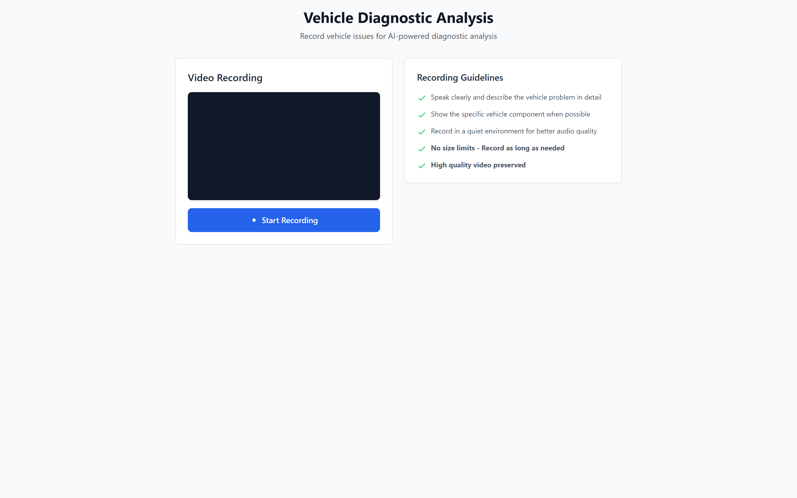

# Video Audio Analyzer

> Record a video of a car problem, and get an AI-powered diagnosis — automatic audio transcription plus a structured mechanic-style report.


Video Audio Analyzer lets a user record a video describing a vehicle issue directly in the browser, uploads it to the backend in resilient chunks, transcribes the spoken audio with **AssemblyAI**, and runs the transcript through a **Groq**-hosted LLM to produce a structured diagnostic report. The report classifies the problem type and severity, extracts technical keywords, and returns concrete repair recommendations — augmented by a built-in dictionary of 90+ automotive fault keywords.

<p align="center">
  
</p>

## ✨ Features

- **In-browser video recording** — captures camera + microphone via the MediaRecorder API with a live preview and timer.
- **Chunked upload pipeline** — videos are split into 2 MB chunks, uploaded independently, then merged server-side (`/upload-chunk` → `/merge-chunks`), with cancel/cleanup support for large recordings.
- **Speech-to-text** — audio transcription powered by AssemblyAI.
- **AI diagnosis** — Groq LLM (`llama-3.3-70b-versatile`) returns strict JSON with main problem, problem type, specific issues, severity, keywords, and a recommendation.
- **Keyword detection engine** — scans the transcript against 90+ curated vehicle fault terms across brake, engine, tire/wheel, electrical, suspension, transmission, cooling, and more, grouped by category.
- **Structured diagnostic report** — severity-coded UI showing primary issue, identified problems, recommended action, technical terms, and full transcript.
- **Automatic temp-file cleanup** — merged files and stale chunks are removed after processing.

## 🛠️ Tech Stack

**Frontend:** React 19, Vite 7, Tailwind CSS 3, Axios (source lives in the `frotnend/` folder)

**Backend:** Node.js, Express 4, AssemblyAI SDK, Groq SDK, Multer, ffmpeg-static, fluent-ffmpeg, CORS, dotenv

## 🚀 Getting Started

### Prerequisites

- Node.js 18+
- An [AssemblyAI](https://www.assemblyai.com/) API key
- A [Groq](https://groq.com/) API key

### Installation

> Note: the frontend directory is named `frotnend` on disk (original spelling preserved).

```bash
# Backend
cd backend
npm install

# Frontend
cd ../frotnend
npm install
```

### Environment Variables

Create a `.env` file inside `backend/`:

```env
ASSEMBLYAI_API_KEY=your_assemblyai_api_key
GROQ_API_KEY=your_groq_api_key
PORT=5000
# NODE_ENV / VERCEL are read to toggle serverless vs. local listen
```

Create a `.env` file inside `frotnend/`:

```env
VITE_SERVER_URL=http://localhost:5000
```

> Never commit real API keys. The backend reads keys from environment variables only — with no hardcoded fallbacks.

### Running Locally

```bash
# Terminal 1 — backend (http://localhost:5000)
cd backend
npm run server     # nodemon, or: npm start

# Terminal 2 — frontend (http://localhost:5173)
cd frotnend
npm run dev
```

Open the frontend, allow camera & microphone access, record a clip describing the vehicle issue, then click **Analyze Recording**.

## 📁 Project Structure

```
Vehicle-Diagnostic-Analysis/
├── backend/
│   ├── server.js          # Express API: chunk upload/merge, transcription, Groq analysis, keyword search
│   ├── vercel.json        # Serverless deployment config
│   └── package.json       # name: video-audio-analyzer
├── frotnend/              # React + Vite client (folder name spelled "frotnend")
│   ├── src/
│   │   ├── App.jsx        # VideoProblemDetector: recording, upload, results UI
│   │   └── main.jsx
│   └── package.json
```

---

<p align="center">Built by <b>Syed Ibrahim Ali</b> — Full-Stack &amp; AI Engineer</p>
